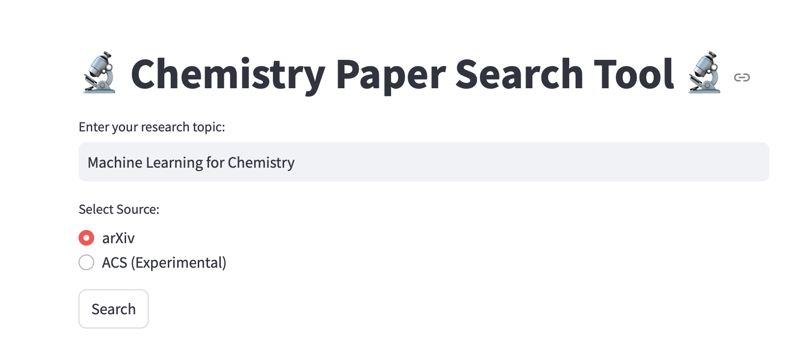
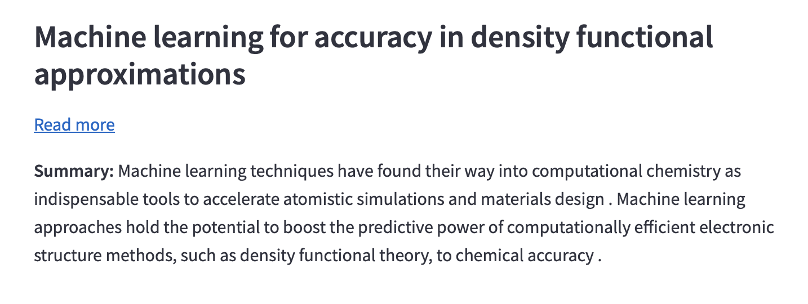

# **Wikistry: Paper Searching Tool for Chemistry**


## **Overview**
Wikistry is an agent tool designed to search for scientific papers related to chemistry from various sources and perform summarization. Currently, the project successfully fetches articles from **arXiv**, while support for other sources such as **ACS (American Chemical Society)** are under development. The tool aims to automate literature searches and extract key information like **titles, abstract, links and summarization using BART model** to research papers.

## **Features**
- ✅ **Fetch research articles from arXiv** based on a query.
- ✅ **Summarizes the abstract of research articles from arXiv** based on BART model.
- 🔄 **Work in progress:** Automating article retrieval from ACS (abstract extraction needs improvement).
- 🛠 **Uses Selenium for web scraping** (ACS) and API-based retrieval (arXiv).
- 📄 **Outputs structured data** (title, summary and link) for easy reference.

## **Installation**
1. **Clone the repository**:
   ```bash
   git clone https://github.com/your-repo/Wikistry-Paper-searching-tool-for-chemistry.git
   cd Wikistry-Paper-searching-tool-for-chemistry
   ```

2. **Set up a Python virtual environment** :
   ```bash
   python3 -m venv my_environment
   source my_environment/bin/activate  # On Windows: my_environment\Scripts\activate
   ```

3. **Install dependencies**:
   ```bash
   pip install -r requirements.txt
   ```

4. **(For ACS support) Install ChromeDriver**:
   - Download the correct **ChromeDriver** for your OS [here](https://googlechromelabs.github.io/chrome-for-testing/).
   - Place it in the project directory or set up the correct path in `script_agent.py`.

---

## **Usage**
### **Fetch Articles from arXiv**
Run the app.py and search for papers on arXiv:



You will then obtain the articles title, link and summary displayed as follow:



---

## **License**
This project is open-source under the **MIT License**.

---

## **Contact**
For any questions, suggestions, or bug reports, feel free to reach out or create an issue in the repository.

🚀 **Happy Summarization!** 🚀
